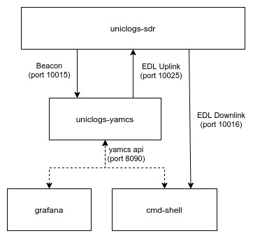

# UniClOGS Yamcs

[Yamcs] based mission control software for UniClOGS

## Yamcs

Run without docker:

- **Note:** On systems with older versions of Java, like Java v8, the
`<release>11</release>` line in `pom.xml` will cause a release error. Change
that line to `<!-- <release>11</release> -->`) to fix that error. This can't be
merged in as that change will cause problems with newer versions of java that
`uniclogs-yamcs` is more targeted for.
- Install dependencies `maven npm`
- Run `$ mvn yamcs:run`
- Open `http://localhost:8090` in a web browser.
- Default `user:passwd` is `admin:admin`

Run with docker:

- For dev image (just runs yamcs in a container, no install):
  - `$ docker-compose build`
  - `$ docker-compose up`
- For prod image (install yamcs into correct dirs in docker image):
  - `$ docker-compose -f docker-compose.prod.yaml build`
  - `$ docker-compose -f docker-compose.prod.yaml up`

## Command Shell

The user interface for uniclogs yamcs.

How to:

- Install dependencies: `$ pip install -r cmd_shell/requirements.txt`
- Start Yamcs
- Run `$ python3 -m cmd_shell`

## Resources

- [XTCE Element Description (CCSDS Green Book)](https://public.ccsds.org/Pubs/660x1g1.pdf)
- [XTCE (CCSDS Green Book)](https://public.ccsds.org/Pubs/660x2g2.pdf)

[Yamcs]:https://yamcs.org/
