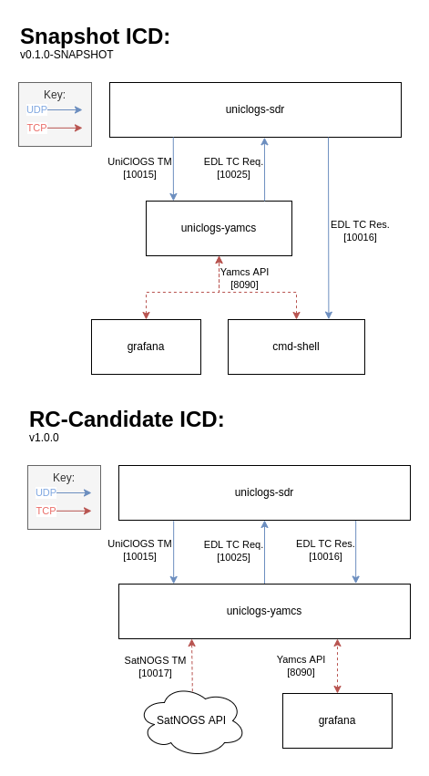

# UniClOGS Yamcs

 

A custom deployment of [Yamcs] for the UniClOGS network.

&nbsp;

***

# Installation and Usage

## Docker Install:

> **Note:**
>
> The security module is enabled by default for this docker-image, and the default *username/password* is `admin/admin`. It is heavily recommended to change it upon first login for non-development environments.

&nbsp;

## Pull the development image from Dockerhub:

`docker pull oresat/uniclogs-yamcs:dev`

### Initialize yamcs configs submodule

`$` `git submodule update --init --recursive`

### Interface Connection Diagram(s):

Below is a set of diagrams outlining both how Yamcs in its current state works, as well as what the target ICD layout is for the first official release of `uniclogs-yamcs`.

***

## Install Submodules and Development Dependencies

### Initialize submodules

`$` `git submodule update --init --recursive`

### System Prerequisites

* `Java JDK >= 17`

## Install Project Dependencies

Install the required project dependencies from the official maven repos and start yamcs in debug mode.

  `$` `mvn clean yamcs:debug`

Open [Local Yamcs] in a browser

> **Note:**
>
> The Security module is disabled by default, though, on ocassion, the Yamcs Auth module may send you to `/auth/authorize` erroneously. Simply re-travese to [Local Yamcs] again to bypass this error.

&nbsp;

***

## Command Shell Usage

The user interface for uniclogs yamcs.

How to:

- Install dependencies: `$` `pip install -r cmd_shell/requirements.txt`
- Start Yamcs
- Run `$` `python3 -m cmd_shell`

&nbsp;

***

## Appendix and Resources

- [XTCE Element Description (CCSDS Green Book)](https://public.ccsds.org/Pubs/660x1g1.pdf)
- [XTCE (CCSDS Green Book)](https://public.ccsds.org/Pubs/660x2g2.pdf)

[Yamcs]:https://yamcs.org/

[Local Yamcs]:http://localhost:8090/